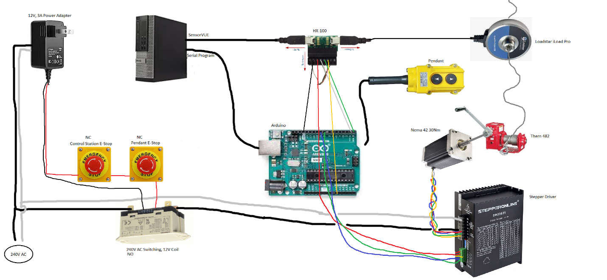
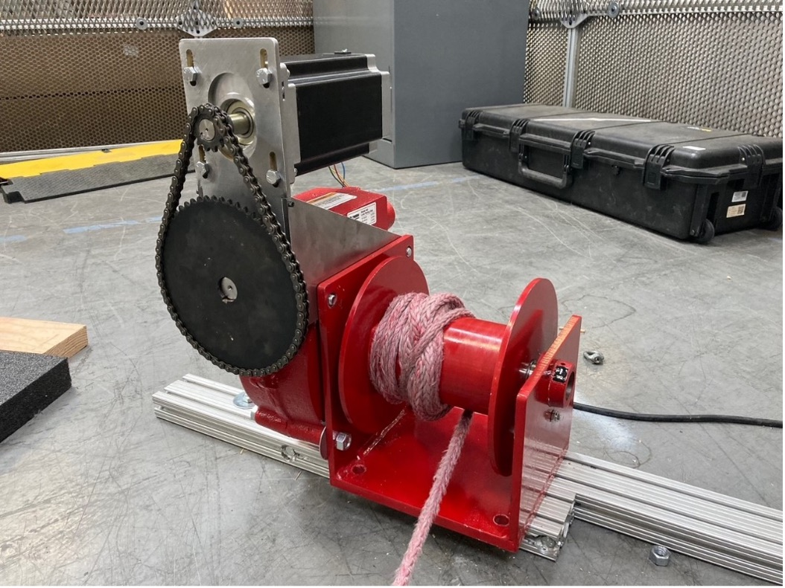
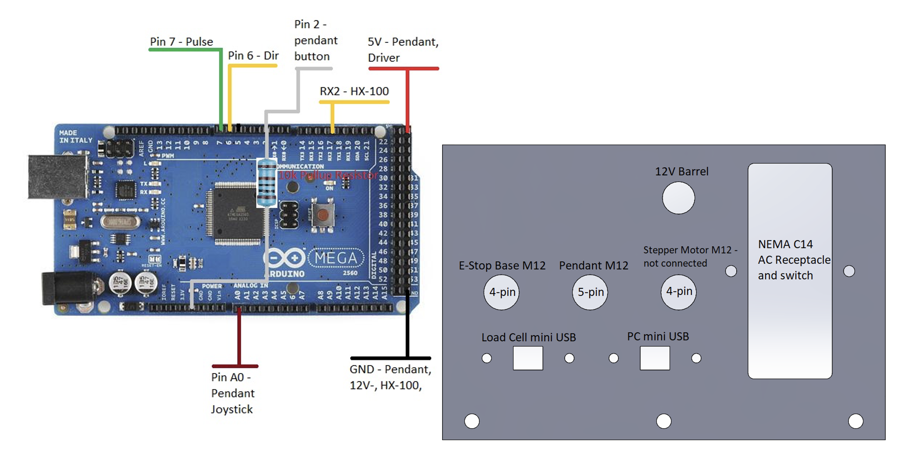
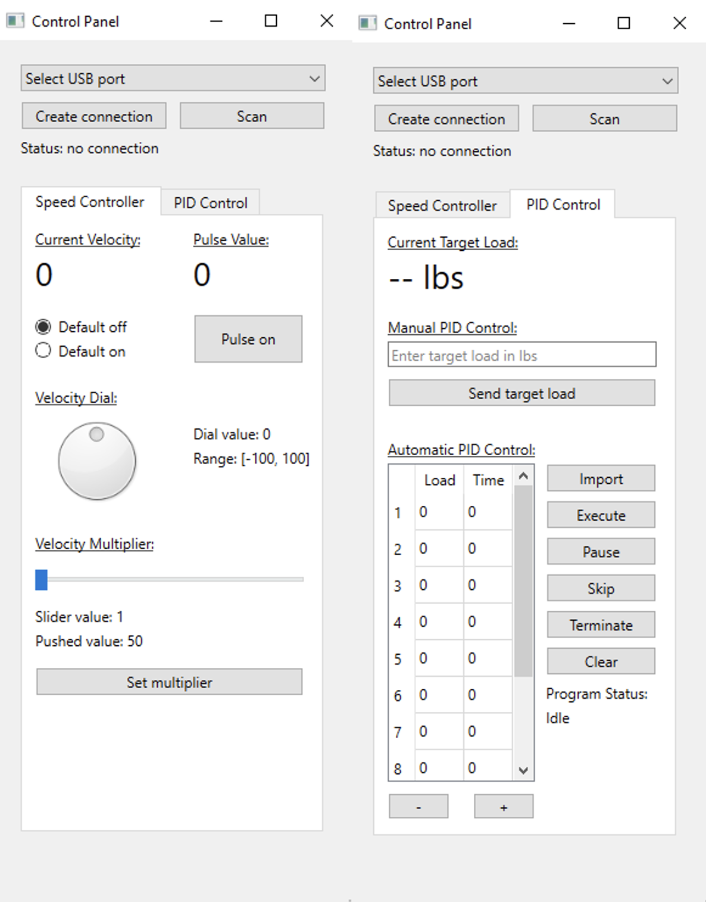
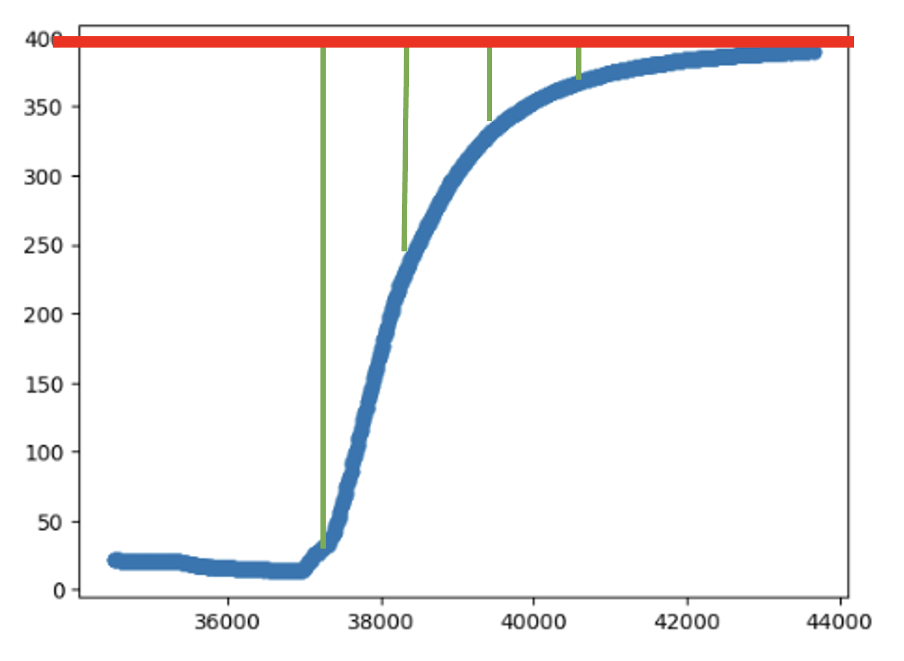
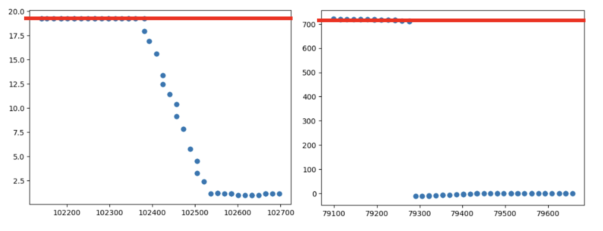
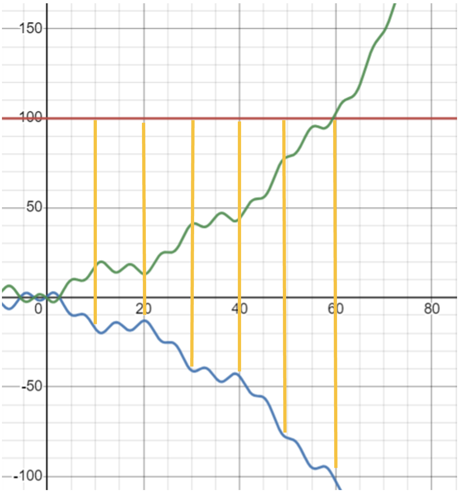

# pid-lab
by Philippe Wu and Michael Price

## System Overview
The PID winch system is intended to add a degree of automation to the static test lab by reducing the number of operators and increasing the load application accuracy. Our system consists of a powered winch, control box, load cell, pendant, E-stop, and a PC. Here is a general system-wide wiring diagram for reference. Actual connections may vary.

## Mechanical/Electrical Setup
### Winch

The winch is the actuator of the PID system. A 3500lb maximum pulling force was a requirement for this project so a nema 42 stepper motor was chosen for this application at a 130:1 total reduction.  The reasoning for this is as follows: with a 3500lb force applied tangentially at the 4” diameter winch drum, 583ft-lbs (791Nm) would be required. Through the 26:1 worm and 5:1 chain reductions, this reduces to only 4.5ft-lbs (6.1Nm) that the motor needs to apply. A 22.1ft-lb (30Nm) motor was chosen for a few reasons: frictional losses in the worm gear, rope/cable winding on top of itself on the drum, both increase the required motor torque.  Also, the rated 22.1ft-lb torque is holding torque.  Stepper motors, by nature, reduce torque output at higher speeds, so selecting a motor with a much higher holding torque than required to hold 3500lbs allows for acceleration under load.

A single 4-wire cable carries the phase current to the winch motor from the stepper driver.  Currently the winch is powered by 120V AC and 8.2A peak current and has reached a maximum pulling force of 2100lbs before the motor started losing steps. Upgrading to 240V AC as this motor is intended should output the rated 22.1ft-lb torque and is speculated to be able to pull at least the full 3500lbs. Be aware that leaving the system armed for long periods at a high current setting can make the motor too hot to touch. It is normal for stepper motors to get this hot.

### Control Box

The “Control Box” is the heart of the system. It contains the stepper motor driver, power relay, HX-100, and the Arduino mega microcontroller. This is intended to go somewhere near the PC in the static test lab area.  Note that the HX-100 is a signal breakout for the Arduino only and has no internal circuitry. The system currently has four independent power sources:
* PC USB --> Arduino, pendant
* PC USB --> load cell through HX-100
* 12V Adapter --> E-stop and relay coil circuitry
* 120V – 240V AC --> Stepper driver and motor through relay

Below is a pinout of the Arduino to the other devices as well as the port assignment. Please note the color coding on the M12 connectors. The 5-pin pendant can fit into either 4-pin M12 connectors so make sure to match colors. Nothing bad should happen if the pendant is plugged into the E-stop port, but the system won’t arm and work as intended. The M12 cable for the stepper motor has not been wired up for fear of the wire gauge being too small or chance of mistakenly connecting another device to the high-power driver output. The stepper driver has current and microstepping settings by dipswitches. The microstepping shouldn’t need to be adjusted, but adjusting the current limit is a rough way to set a limit on the maximum pulling force. At the time of writing, these settings are: 7.3A peak current and 800pul/rev microstepping. There is a cutout for a NEMA C14 Receptacle which has not been ordered yet.

### Pendant
The pendant is a handheld remote control for the winch. This is intended to reside inside the static test area to be used to adjust slack in the rope/cable during setup. To jog the winch, the joystick must first be depressed. This is a safety feature. The pendant has an M12 5-pin connector and a 5-meter cable length.

### E-stop Base
This is a simple E-stop switch that is intended to be located on the desk by the control PC within easy reach of the test operator. The E-stop base has an M12 4-pin connector and a 2-meter cable length.

### Load Cell
The load cell measures the force of the static pull and provides force feedback for the PID controller. This system is designed to use Loadstar iLoad pros with serial output calibrated in TENSION ONLY. Using an iLoad pro calibrated in compression will result in a positive feedback error at best.  The S-beam load cells will not work because they output USB, not serial.

### E-stop System
There are two normally closed E-stops wired in series through a 12V power supply and relay coil. Both the pendant and E-stop base must be plugged in and depressed before the power relay can close to arm the system. The relay will light and the motor will hiss when the system is armed.

## Control Panel PC Application

The Control Panel Application is a custom GUI software that serves as the main user interface for the operation of the system. The application allows for an intuitive interface to command the system without having to access the command line. The GUI is built in Python 3.11.4 and makes use of several open-source frameworks and libraries: the PySide6 6.5.2 framework, the official Python wrapper for Qt, for GUI and application development, pySerial 3.5 for serial communication between the PC and the Arduino, and pandas 2.0.3 and NumPy 1.25.2 for data processing. The code is packaged into an application using PyInstaller 5.13.0 in .exe format. The application can be distributed and run on any computer without Python or any of the dependencies installed. To edit or make changes to the code, it is recommended that the same versions of Python and its libraries are installed.

The Python language is chosen for the application primarily due to its ease of use and extensive ecosystem of open-source libraries. C++ (or Java) is usually considered a better language for application development, but for the purposes of this application, the performance differences in performance between Python and C++ are negligible. The Qt framework for GUI development is one of the most popular frameworks for application development. Qt was chosen for its reputability, extensive documentation, open-source governance, cross-platform compatibility, flexibility, and availability in C++ and Python.

This section outlines the main features and architecture of the Control Panel program. For an in-depth explanation of the code and the development procedures, please see the markdown file (application_documentation.md) file included in the application folder.

### Overview
The Control Panel Application provides three major functions to the user:
1.	Managing the PC-Arduino communication
2.	Operating the system via manual speed control
3.	Operating the system via PID control

The application consists of a window and two tabs. The buttons at the top of the window manage the PC-Arduino communication. The speed controller tab consists of the manual speed controller and the PID control tab allows the user to operate the system via PID control.

### Managing Connections
The dropdown menu at the top lists the available serial connections to the computer. Upon opening the application, the program will scan for available connections. If you make any changes to your serial ports, the “Scan” button tells the software to look again for serial connections. Once the Arduino board is selected, pressing the “Create connection” button connects the PC to the Arduino and updates the connection status shown by the program.

### Manual Speed Controller
The manual speed controller is found under the “Speed Controller” tab. This speed controller is meant to be a digital version of the control pendant and operates the stepper motor in a similar way, by commanding the motor to turn forward or backward at a specific speed. The controller consists of a velocity dial and a multiplier slider. The velocity dial goes from -100 to 100. By turning the dial, the user can turn the stepper motor faster or slower (or backwards in the negative range). The stepper motor will respond to changes in the velocity dial instantaneously.

The multiplier slider ranges from 1 to 100 and represents a constant that scales the velocity (given by the dial) of the motor. The default value for this constant is set at 50. Sliding the dial does NOT affect the motor speed instantaneously. Instead, the “Set multiplier” button must be pushed to set the new velocity constant. The pushed value indicator will now remember and display the new pushed value. We recommend only adjusting the multiplier to increase or decrease the granularity of control.

Finally, are two modes to the speed controller: default off or default on. In default off mode, the current velocity is always set to 0. Turning the dial will change the pulse velocity. The system is activated by holding the “Pulse on” button which sets the current velocity equal to the pulse velocity. Releasing returns the current velocity to 0. In default on mode, the current velocity is equal to the velocity dial and while the pulse value is set to 0. Pressing and holding the “Pulse off” button sets the current velocity equal to 0. Default off is the default and recommended mode for the system. Switching between control systems always returns the controller to default off mode.

### PID Controller
The PID controller is located under the “PID Control” tab. This controller allows the user to pass in a target load (in lbs), which the system will eventually reach automatically via PID. There are, again, two methods to use the PID controller.

First, the user can manually send a target load value to the system by entering a number in the textbox and pressing “Send target load.” This action will update the current target load display value and command the system to pull until it reaches the target load.

Automatic PID control is the second PID method, allowing the user to program in a sequence of loads to the system. The application features an editable program table with load in column one and time in column two. A sequence of loads can be entered into column one with the duration of the command (in seconds) entered into the corresponding row of the time column.

The figure to the above shows an example of a program running in-progress. The program will send a load of 50 lbs, wait for 30 seconds, then send a load of 100 lbs, wait for 30 seconds, then send a load of 200 lbs, wait for 30 seconds, and finally send a load of 0 lbs, after which the program will terminate. The smallest time allowed in the time column is 3 seconds. It is important to note that a row is skipped of the time at that row is set to 0. Thus, if the desired endpoint of the program is 0 lbs, the user must manually enter in the final row, 0 lbs for load and a non-zero number of seconds for column. The rest of the program is skipped because 0 seconds is entered for time.

There are various controls available to the user. After entering a program, the user may press “Execute” to run the program. The “Pause” button stops the timer from counting the program. The “Skip” button automatically starts the next row. The “Pause” and “Skip” buttons may be used simultaneously to disable automatic timing in the program. Finally, the user may end the program early by pressing “Terminate”. Note, pressing “Terminate” will freeze the stepper motor in place but pressing “Pause” will not.

The program table can be cleared by pressing the “Clear” button. The table may be expanded or reduced by using the add and subtract buttons below the table. Finally, the “Import” function allows the use of excel spreadsheets to automatically populate the fields of the program.

### Safety Features
The system can pull up to 3500 lbs, but the current setup is limited to operate up to 1600 lbs. The application will take loads of up to 1600 lbs before throwing an error at the user. Several functions are disabled when a program is currently running. If the user wishes to switch the manual control while a program is running, the system will prompt the user to either terminate the program or disallow the use of manual control.

### PC-Arduino Communication
Executing commands on the GUI sends packets of serial data that is decoded, interpreted, then executed by the Arduino. An instruction takes the form of five digits and an end character ‘e’. Several examples of instructions is “11145e”. The first of the five digits denotes the mode of instruction (1 is PID mode) and the next four denotes the numerical value sent (1145 lbs). The ‘e’ indicates to the Arduino that the instance of the serial data packet is complete, and the subsequent bits of data should be interpreted as a separate command.

## Arduino Code
The role of the Arduino is to receive data from the load cell and commands from the PC. PID response calculations occur on the Arduino board which then sends electrical signals to the stepper motor driver. The Arduino also handles the manual override from the pendant and error detection features in the system.

Arduino code is written in C++. The code utilizes the AccelStepper library to drive the stepper motor, the AutoPID library for PID response calculations, and the TimerOne library for timing. The code is well commented if changes need to be made. This section outlines the high-level overview of the Arduino and explanation of the custom algorithms implemented. For additional technical details, please see the markdown file (arduino_documentation.md) in the application folder.

### Control Hierarchy
Together with the system wiring, the Arduino code implements a control hierarchy to deal with the multiple ways of commanding the system. The hierarchy is as follows:

E-stop > Manual Pendant > Digital Speed Controller > Digital PID Controller.

### PID Control
PID control calculations occur on the Arduino with tuned parameters. At the time of writing, the PID controller uses a 0.3 proportional gain, no integral gain, and no derivative gain. In other words, the PID system is just a proportional response controller.

The figure above shows a load vs. time graph of an example pull. At about 37 seconds, the system is commanded to reach 400 lbs (red line) from 0 lbs. The error between the setpoint and the current load is 400 (green line), so the PID multiplies the error by the proportional gain to get the response. The response pulls the rope which reduces the error between the setpoint and the load, which can be seen by the blue line. By reducing the error, the PID response decreases. The stepper motor slows down until the target setpoint is reached.

Formally, the PID response function u(t) is given by
$$u(t)=K_p e(t) + K_i \int_0^t e(\tau)d\tau+ K_d  \frac{de(t)}{dt}$$
where $e(t)$ is the error function, $K_p$ is the proportional gain, $K_i$ is the integral gain, and $K_d$ is the derivative gain. For this system,

$$\begin{aligned}
&e(t)=\text{target}_t-\text{reading}_t\\
&K_p=0.3,\qquad K_i=0,\qquad K_d=0
\end{aligned}$$

so the system specific PID response is given by
$$u(t)=0.3(\text{target}_t-\text{reading}_t).$$

Proportional only PID has performed very well during testing. However, additional tuning may be required to get the system to operate optimally. For very flexible materials, proportional only controls may cause the system to pull to slowly. If this proves to be a problem, we recommend setting $K_i$ to be a small positive value. If the system is reacting too fast or experiences overshoot and/or oscillation, we recommend setting $K_d$ to be a small positive value or reducing $K_p$.

### Breakage Detection Algorithm
Breakage detection stops the system in the event the sensed load decreases rapidly, such as breakage or slippage of the rope or fixture. Breakage detection prevents the PID from continuously pulling should a material failure occur, dropping load. Breaks are characterized in load graphs by a sudden, sharp decrease in load. The figure below shows two different load vs. time graphs during a break. The red line indicates the load setpoint. After the break, the program voids the setpoint and freezes the system.

Several conditions must be met before a break detection error is thrown.  If the system is in PID mode, the current setpoint is greater than the previous setpoint, and the actual load decreases by more than a set percentage while over 10lbs, then breakage is triggered, freezing the system until a new target load is commanded.  The load > 10lbs condition exists to prevent breakage being detected when sensor noise makes up a non-negligible portion of the sensed load.

### Positive Feedback Detection Algorithm
Existing load cells may be calibrated in tension or compression. Tension cells read positive when pulling while compression cells read negative when pulling and vice versa when pushing. The system is only compatible with tension cells. Increasing pulling force will cause the compression load cell to read more negative, thus increasing the error function and the PID response.

A positive feedback detection algorithm is implemented to prevent runaway control. Ideally, this detection algorithm will never be activated. However, positive feedback can result in catastrophic damage to the setup in a very short amount of time if unattended to. When the conditions of the detection are met, the system freezes and notifies the user to check the load cell.

The figure below shows a positive feedback loop in a load vs. time graph. The setpoint is given by the red line, the load reading is given by the blue line, the error function is given by the orange lines, and the true load is given by the green line. Signal noise, rope slippage, and deflection are characterized by the perturbations seen in the line. Here, the error function induces a pull in the system, bringing the true load closer to the setpoint. However, the cell reads the negative of the true load so the error function increases, causing the system to increase pulling speed. This positive feedback loop causes the true load to blow past the setpoint.

We cannot simply take the absolute value of the cell that would cause positive feedback in the negative region of the cell. We also cannot just trigger positive feedback when the instantaneous error function increases more than a desired amount because the relative sizes of perturbations change at higher loads. Instead, we approach this problem by measuring how the error function changes.

In a negative feedback loop, the general trend of the absolute value of the error function is decreasing as the load reading approaches the setpoint. To detect positive feedback, we wish to know whether the absolute value of the error function is increasing over time. Recall that the error function is given by

$$e(t)=\text{target}_t-\text{reading}_t.$$

We now define a difference function $\Delta_t$ as

$$\Delta_t=|e(t)|-|e(t-1)|$$

which measures the change in error in a timestep. If $\Delta_t>0$ consistently, then the system is a positive feedback loop. But perturbations in the system (as seen in the figure above) mean that we cannot expect $\Delta_t>0$ to always be true in a positive feedback loop. To filter out noise and capture the general trend of $\Delta_t$, we apply exponential smoothing to the time-series function to get the exponential moving average of $\Delta_t$ given by the recursive equation

$$EMA_t=EMA_{t-1}+(1-\delta)(\Delta_t-EMA_{t-1})$$

where $\delta$ is a discount factor between 0 and 1, $EMA_t$ is the exponential moving average at current time, and $EMA_{t-1}$ is the exponential moving average at previous time. For this system,

$$\delta=0.95,\qquad \Delta t=0.1s.$$

We define a positive feedback loop to be when $EMA>0.1$ is true for at least 15 consecutive times (increasing for 1.5 seconds), or if $EMA>1.5$ is ever true.

There are several considerations if this function should need to be tuned. The discount factor $\delta$ controls the rate of decay. A large $\delta$ means the function is smoother and as $\delta$ approaches $0$, $EMA$ approaches $\Delta$. Reducing the time step $\Delta t$ will give the function more resolution but also has the effect of quicker decay ($EMA$ gets closer to $\Delta$). The condition of 15 consecutive times should also change accordingly with a change in $\Delta t$. Finally, to increases the sensitivity of the function, decrease the positive feedback conditionals (decrease 15 and 1.5).

### Sensor Disconnect Detection Algorithm
This algorithm detects if the load cell has either been disconnected or is connected but not sending data.  Without this, if the load cell were disconnected in PID mode, the system would keep the last known load and the error function remains constant. The motor will run at constant velocity regardless of the actual load applied, creating a runaway situation. We use a timeout to trigger an error and freeze the system when the Arduino stops receiving data from the load cell for more than 0.3 seconds. This time is configurable.

## Operation
### Setup
1.	With the station E-stop pressed, connect the control box to 120V AC or 240V AC and plug in the 12V DC adapter. Also plug in the USB Arduino cable and S2U interface from the load cell to the PC.
2.	Connect the load cell to the control box.
3.	Launch SensorVUE and the Control Panel application. Press “start” in SensorVUE.
4.	Select the COM port for the Arduino in the dropdown menu and click “Create connection.”
5.	Depress the E-stop while observing the behavior of the winch. The winch should now be operational and should respond to manual and automatic commands.

### Manual Control
Set up a pull like normal and tie off most of the slack. Zero the load cell. Use the pendant to take up the remaining slack. Make sure the rope is not winding over itself on the winch drum as this could cause errors or max out the system at higher loads.

### PID Control
Use the textbox to command the system to pull at a specified load. For automatic control, either import an existing program saved in an excel sheet or enter the program sequence in the table. Note that an instruction in a sequence must have a non-zero time value in order to be executed as zero time values are automatically skipped. After loading the program, press “Execute” to run the program. To disable the timing function and take control of the sequence, simply pause the timer and use the “Skip” button to pass the next command. Press “Terminate” to prematurely end the program and freeze the system in place.

## Parts List
